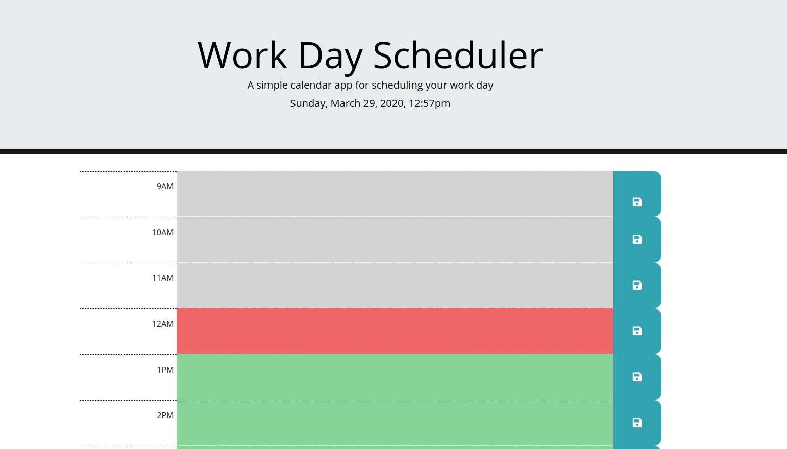
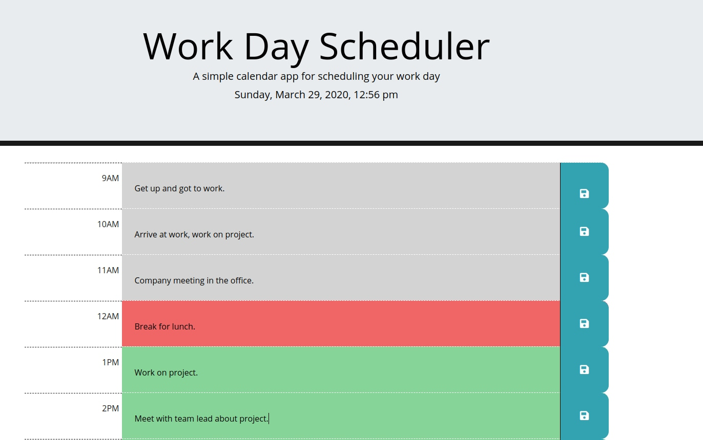

# Project Name: Work Day Scheduler

# Link to application:
https://dolinay1.github.io/work-day-scheduler/Develop/index.html

# Description:
The application shows the current day and time, and allows the user to record event for specified times in their schedule. The date and time are displayed using methods from the Moment.js library. According to the hour, the input field will change color. The color will be green if the hour has yet come, red for  the current hour, and gray for the past hours. These changes are also deployed using Moment.js. Finally the user may record an event in their scheduler by typing it in the input field and pressing the save button to save it. The users event is saved to local storage, so even on a page refresh the event will stay in the input field.

# Technologies Used:
HTML, Javascript, CSS, Bootstrap 4, Jquery, Moment.js

# Screenshots:

